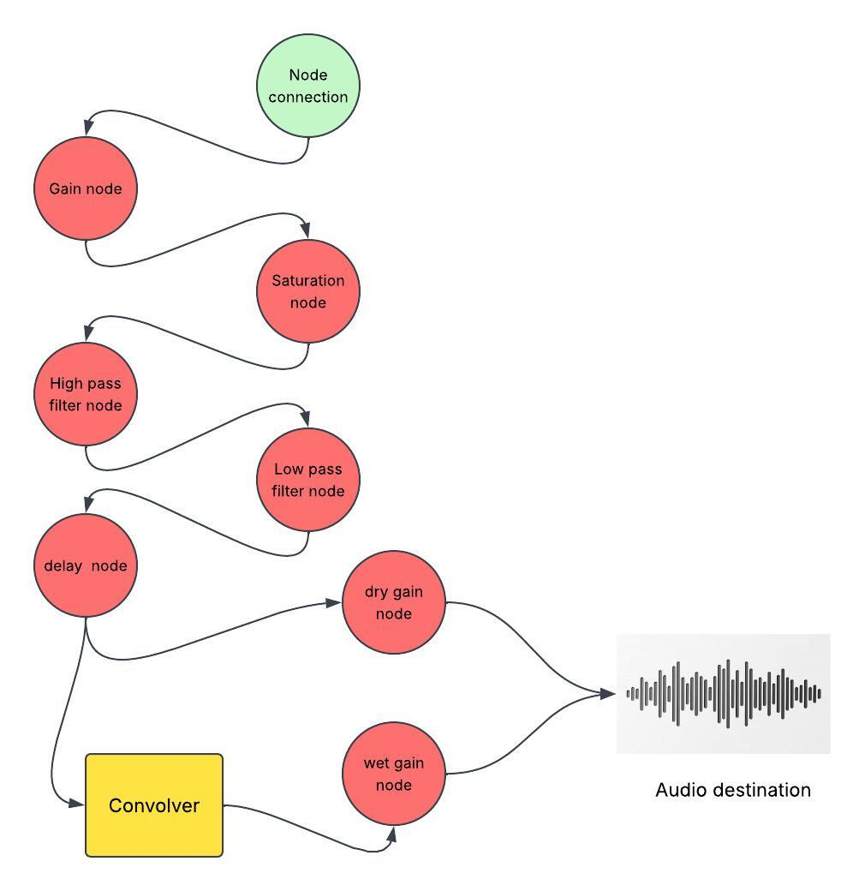

# Audio Effects Engine

The `AudioEffectsEngineService` is the core audio processing engine of the application. It is built on top of the **Web Audio API** and provides real-time audio processing through a graph of interconnected audio nodes.

The engine is responsible for:

- Gain control
- Saturation (analog distortion)
- High-pass filter
- Low-pass filter
- Delay
- Reverb
- Slow/Pitch playback
- Reverse playback

---

# Architecture

The following diagram illustrates the audio processing graph implemented by the service.


---

# Audio Graph

```
HTMLMediaElement
        │
        ▼
MediaElementAudioSourceNode
        │
        ▼
GainNode
        │
        ▼
WaveShaperNode (Saturation)
        │
        ▼
HighPassFilter
        │
        ▼
LowPassFilter
        │
        ▼
DelayNode
      ├──────────────► Dry Gain ─────────► Audio Destination
      │
      ▼
 Convolver
      │
      ▼
 Wet Gain ──────────────────────────────► Audio Destination
```

The engine processes the audio sequentially until the signal reaches the output (`AudioDestinationNode`).

---

# Processing Pipeline

## 1. MediaElementAudioSourceNode

Transforms an HTML `<audio>` element into a Web Audio source.

```ts
this.audioContext.createMediaElementSource(mediaElement)
```

This node is the entry point of the processing graph.

---

## 2. Gain Node

Controls the overall output volume.

```ts
setGain(db:number)
```

Internally, decibels are converted into linear gain.

```text
Decibels
    │
    ▼
GainNode
```

---

## 3. Saturation

Implemented using a `WaveShaperNode`.

```ts
this.audioContext.createWaveShaper()
```

The saturation curve is generated dynamically.

```ts
createSaturationCurve()
```

Each call to

```ts
setSaturation(value)
```

updates the distortion curve in real time.

---

## 4. High Pass Filter

Removes low frequencies below the configured cutoff frequency.

```ts
setHighPass(frequency)
```

Internally:

```ts
highPassFilter.type = "highpass"
```

---

## 5. Low Pass Filter

Removes high frequencies above the configured cutoff frequency.

```ts
setLowPass(frequency)
```

Internally:

```ts
lowPassFilter.type = "lowpass"
```

---

## 6. Delay

Adds a temporal delay to the processed signal.

```ts
setDelay(value)
```

Internally:

```ts
delayTime = value / 100
```

After this node the signal splits into two independent paths.

---

# Dry / Wet Signal

The engine separates the signal into:

## Dry Path

Contains the processed signal without reverb.

```
Delay
   │
Dry Gain
   │
Destination
```

---

## Wet Path

Contains only the reverberated signal.

```
Delay
   │
Convolver
   │
Wet Gain
   │
Destination
```

Both signals are mixed together at the destination.

---

# Reverb

The reverb effect is implemented using a `ConvolverNode`.

```ts
this.audioContext.createConvolver()
```

Instead of loading an external impulse response, the engine generates one procedurally.

```ts
createImpulseResponse(duration, decay)
```

The impulse response simulates the reflections of a physical acoustic space.

The reverb amount is controlled by balancing the dry and wet signals.

```ts
setReverb(value)
```

```
Reverb = 0%

Dry 100%
Wet   0%

------------------------

Reverb = 50%

Dry 100%
Wet  50%

------------------------

Reverb = 100%

Dry 100%
Wet 100%
```

---

# Slow / Pitch

Playback speed is **not** implemented as part of the node graph.

Instead, it directly modifies the HTMLMediaElement.

```ts
mediaElement.playbackRate = rate
```

Pitch preservation is disabled.

```ts
mediaElement.preservesPitch = false
```

This allows both playback speed and pitch to change simultaneously.

---

# Reverse Playback

Reverse playback is an offline process rather than a real-time effect.

Workflow:

```
Original URL
      │
      ▼
fetch()
      │
      ▼
decodeAudioData()
      │
      ▼
AudioBuffer
      │
      ▼
reverseBuffer()
      │
      ▼
WAV Blob
      │
      ▼
Blob URL
```

Steps:

1. Download the original audio.
2. Decode it into an `AudioBuffer`.
3. Cache the decoded buffer.
4. Reverse every audio channel.
5. Convert the buffer into WAV.
6. Create a Blob URL.
7. Reuse the Blob URL until another audio file is loaded.

The engine avoids reversing the same file multiple times through an internal cache.

---

# Internal Cache

The reverse effect uses three cache objects.

| Property | Purpose |
|----------|----------|
| `originalBuffer` | Stores the decoded audio buffer |
| `originalUrlLoaded` | Keeps track of the currently loaded audio |
| `reversedBlobUrl` | Stores the generated reversed audio |

This avoids unnecessary decoding and buffer manipulation.

---

# Resource Cleanup

When a new media element is assigned, all previous node connections are removed.

```ts
resetNodes()
```

This prevents duplicated audio graphs.

When the service is destroyed:

- Blob URLs are revoked.
- The `AudioContext` is closed.

```ts
ngOnDestroy()
```

---

# Audio Features

| Feature | Implementation |
|----------|----------------|
| Gain | GainNode |
| Saturation | WaveShaperNode |
| High Pass | BiquadFilterNode |
| Low Pass | BiquadFilterNode |
| Delay | DelayNode |
| Reverb | ConvolverNode |
| Slow/Pitch | HTMLMediaElement PlaybackRate |
| Reverse | AudioBuffer Offline Processing |

---

# Design

The engine intentionally separates effects into two categories.

## Real-time Effects

Executed inside the Web Audio graph.

- Gain
- Saturation
- High Pass
- Low Pass
- Delay
- Reverb

These effects are updated instantly while the audio is playing.

---

## Offline Effects

Require processing the audio buffer before playback.

- Reverse

---

## Media Playback Effects

Applied directly to the media element.

- Slow
- Pitch

---

This separation keeps the engine modular, efficient, and easy to extend with additional DSP effects in the future.


---

# Monekai Engine Graph

